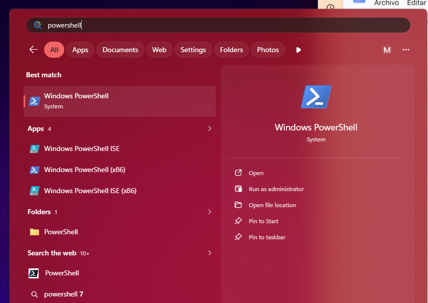
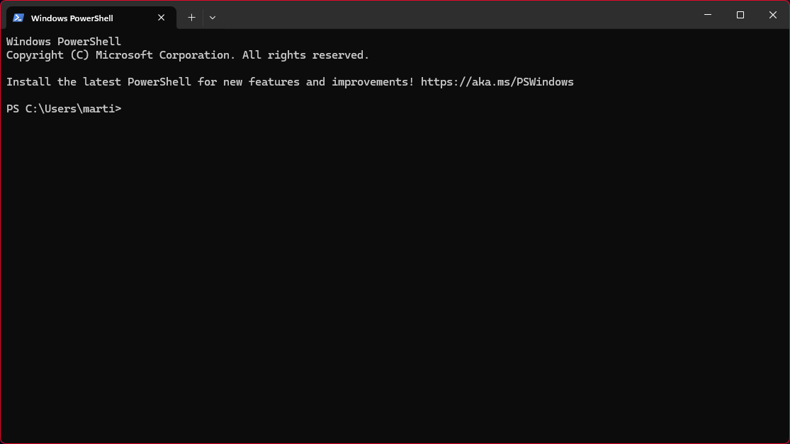
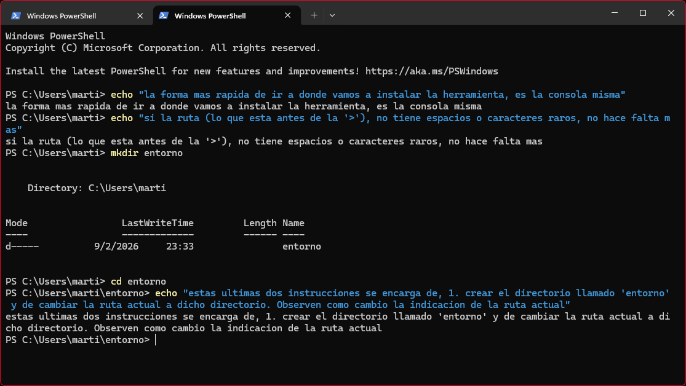
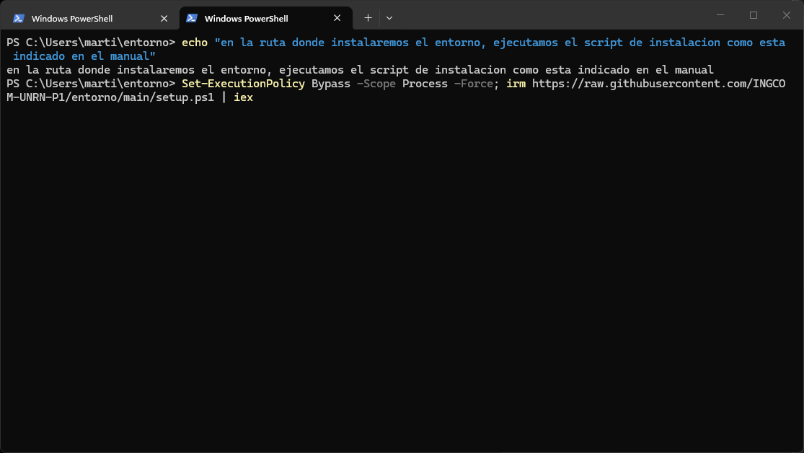
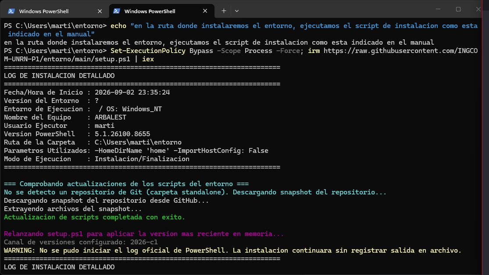
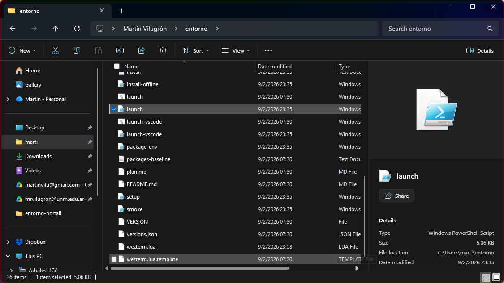
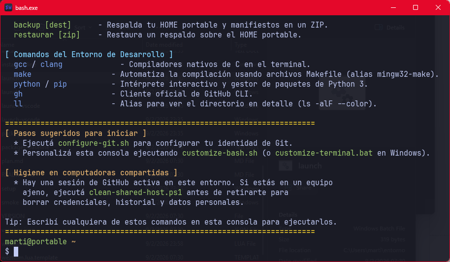

# Guía de Instalación y Uso en Windows (Paso a Paso)

Este manual describe el procedimiento completo para instalar, aprovisionar y poner en marcha el **Entorno de Desarrollo Portable en C y Python** en sistemas operativos Windows (10 y 11), guiado paso a paso a través de las capturas de pantalla oficiales del proceso.

---

## Requisitos Previos

* **Sistema Operativo:** Windows 10 (versión 1903 o superior) o Windows 11 de 64 bits (x64).
* **Conectividad:** Conexión a Internet activa para la descarga inicial de paquetes y herramientas.
* **Permisos:** No se requieren privilegios de Administrador del sistema; la instalación se realiza íntegramente en el espacio de usuario.
* **Ruta de instalación:** La carpeta donde se instale el entorno **no debe contener espacios, tildes ni caracteres especiales** (por ejemplo: `C:\Users\tu_usuario\entorno` o `D:\entorno_p1`).

---

## Paso 1: Abrir la Consola Windows PowerShell

Presioná la tecla `Windows` (o hacé clic en el botón de Inicio) y escribí **"PowerShell"**. Entre los resultados de búsqueda, seleccioná **Windows PowerShell**.



> [!NOTE]
> No es necesario seleccionar "Ejecutar como administrador". La instalación está diseñada bajo el principio de mínimo privilegio y se ejecuta de forma segura en tu sesión estándar de usuario.

---

## Paso 2: Ventana Inicial de PowerShell

Al iniciar PowerShell, se abrirá la consola mostrando la línea de comandos en tu directorio personal predeterminado (por ejemplo, `PS C:\Users\marti>`):



---

## Paso 3: Crear y Navegar al Directorio de Instalación

Para mantener tu sistema ordenado y garantizar que el entorno sea verdaderamente portable, creá un directorio dedicado para alojar las herramientas y accedé a él desde la misma consola:

```powershell
mkdir entorno
cd entorno
```



Al ejecutar estos dos comandos:
1. `mkdir entorno` crea una nueva carpeta llamada `entorno` en tu ubicación actual.
2. `cd entorno` cambia la ruta activa hacia dicha carpeta. Observá cómo el prompt de PowerShell se actualiza a `PS C:\Users\marti\entorno>`.

> [!IMPORTANT]
> Verificá siempre que la ruta que aparece antes del signo `>` no contenga espacios ni caracteres acentuados. Las herramientas de compilación Unix y GCC requieren rutas limpias para evitar fallos de resolución de cabeceras y enlazado.

---

## Paso 4: Ejecutar el Script de Instalación Online

Dentro de la carpeta destino (`C:\Users\...\entorno`), copiá y pegá la siguiente instrucción completa en la consola y presioná `Enter`:

```powershell
Set-ExecutionPolicy Bypass -Scope Process -Force; irm https://raw.githubusercontent.com/INGCOM-UNRN-P1/entorno/main/setup.ps1 | iex
```



### ¿Qué hace esta instrucción?
* `Set-ExecutionPolicy Bypass -Scope Process -Force`: Habilita la ejecución de scripts de PowerShell de forma temporal y exclusiva para la ventana actual de consola, sin alterar las políticas de seguridad permanentes del sistema operativo.
* `irm` (`Invoke-RestMethod`): Descarga el instalador oficial más reciente (`setup.ps1`) directamente desde el repositorio de la cátedra (`INGCOM-UNRN-P1/entorno`).
* `iex` (`Invoke-Expression`): Ejecuta el instalador en memoria para comenzar el aprovisionamiento.

---

## Paso 5: Descarga y Aprovisionamiento del Entorno

El instalador iniciará el proceso de configuración automatizada, registrando cada acción en pantalla:



Durante esta fase, el instalador realiza automáticamente:
1. **Comprobación de versión:** Conecta con GitHub para verificar actualizaciones de los scripts y aplicar la última versión disponible.
2. **Despliegue de MSYS2 UCRT64:** Instala el subsistema Unix optimizado para el Universal C Runtime de Windows.
3. **Instalación de la Cadena de Compilación (Toolchain):**
   * Compilador GCC / G++ nativo x86-64.
   * Herramientas de construcción: `make`, `cmake`, `ninja`.
   * Depurador `gdb` y herramientas de análisis estático `cppcheck`.
   * Intérprete Python 3 con `pip` y `uv`.
   * Cliente oficial de GitHub CLI (`gh`).
4. **Instalación de WezTerm Portable:** Terminal acelerada por GPU preconfigurada con esquema Tokyo Night y tipografía de programación.
5. **Instalación de VS Code Portable:** Editor preconfigurado con extensiones de C/C++, CMake y Python, aislado en `vscode/data/`.

---

## Paso 6: Explorador de Archivos y Lanzadores Disponibles

Al finalizar la instalación, abrí el Explorador de Archivos de Windows y dirigite a la carpeta `entorno`. Encontrarás la estructura de archivos y los cargadores listos para usar:



### Accesos Directos Principales
* **`launch.bat` (o `launch.ps1`):** Inicia la terminal de desarrollo WezTerm con el entorno Bash UCRT64 completamente inicializado.
* **`launch-vscode.bat` (o `launch-vscode.ps1`):** Inicia Visual Studio Code Portable con el compilador GCC, Make y Python inyectados directamente en su terminal integrada.
* **`setup.ps1`:** Script para actualizar o reinstalar componentes en cualquier momento.
* **`clean-shared-host.ps1`:** Script de seguridad para borrar credenciales e historial al usar el entorno en laboratorios públicos o computadoras ajenas.

> [!TIP]
> **Lanzadores nativos sin ventana negra (.exe):**
> Podés compilar lanzadores ejecutables nativos (`launch.exe` y `launch-vscode.exe`) para abrir la consola y el editor sin que aparezca la ventana negra intermedia de CMD. Para generarlos, abrí la terminal portable y ejecutá:
> ```bash
> build-launcher.sh
> ```

---

## Paso 7: Inicio de la Terminal Portable y Verificación

Hacé doble clic en **`launch.bat`** para abrir la terminal WezTerm. Se desplegará la consola portable con el banner institucional de la **UNRN Andina - Programación 1**:



La terminal te recibirá con la lista de comandos disponibles y el prompt portable `usuario@portable ~ $`.

### Comandos Esenciales de Arranque

1. **Verificar el estado de salud del sistema:**
   ```bash
   doctor
   ```
   Compila un programa de prueba en C, verifica el enlazador, Python y el estado de las herramientas.

2. **Configurar tu identidad de Git (obligatorio para entregas):**
   ```bash
   configure-git.sh
   ```
   Configura tu nombre de autor, correo electrónico y opcionalmente inicia sesión con GitHub CLI (`gh auth login`). Toda la configuración queda guardada dentro de tu carpeta `home/` portable.

3. **Crear tu primer trabajo práctico de cátedra:**
   ```bash
   nuevo-proyecto tp01
   cd tp01
   make
   ```
   Genera la estructura estándar con `main.c`, Makefile modular (targets `debug`, `asan`, `test`, `ripley`), `.clang-format` y configuración de depuración con F5 para VS Code.

4. **Consultar la ayuda rápida en cualquier momento:**
   ```bash
   ayuda
   ```

---

## Higiene en Computadoras Compartidas (Laboratorios y Pendrives)

Si utilizás el entorno desde un pendrive en computadoras públicas o de la universidad:

1. Al terminar tu sesión de trabajo, cerrá VS Code y la terminal WezTerm.
2. Desde la carpeta del entorno en Windows, ejecutá con PowerShell:
   ```powershell
   .\clean-shared-host.ps1
   ```
3. Confirmá con `s`. El script eliminará tokens de GitHub, credenciales cacheadas, historiales de consola y temporales del host sin borrar tus proyectos ni los compiladores.
